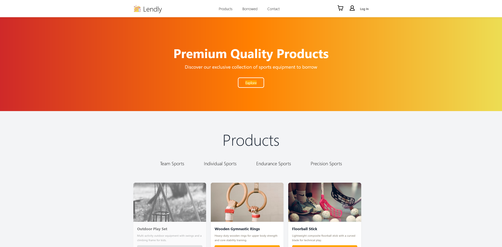
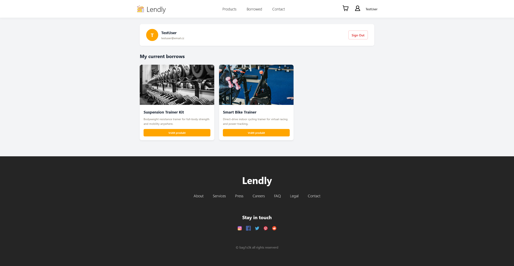
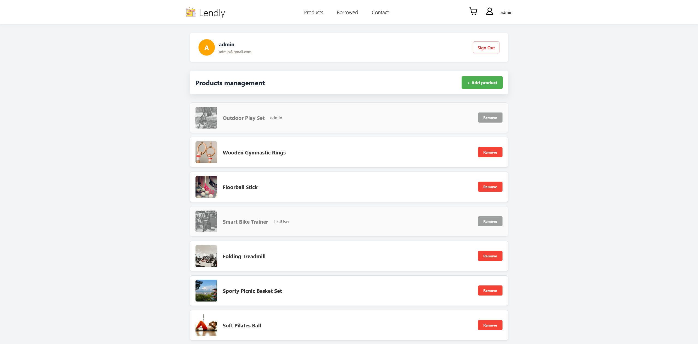

<p align="center">
    
</p>

# Lendly

*A web application for sharing sports equipment.*

Lendly is a school project developed for the **Programming II.** subject. The target was to build a database-connected web application that allows users to easily manage, borrow, and track sports equipment.

## Assignment

1. **Topic:** Sharing sports equipment.
2. **Project Type:** A web application connected to a database (managing users and products).
3. **Specifications:** Tracking available equipment and monitor which user has borrowed what.

## Key Features

### User Functions

* **User Authentication:** Login and Registration system.
* **Equipment Management:** Options to easily borrow or return products. 
* **Visual Feedback:** Borrowed products are immediately displayed in **grayscale**

### Admin Functions (Admin Profile)

* **Inventory Control:** Permissions to add new products or remove existing ones.
* **Tracking System:** An overview of all currently borrowed equipment and the specific users holding them.


### Data Storage
* **MySQL Database:** Storage for all user data and product details
* **Authentication:** User passwords are securely **hashed** before being stored in the database

> [!NOTE]
> This application was developed as a school project \ 
> with a focus on core functionality. Not as a **cybersecurity** project. \
> **Only basic security implemented**

The project is intended for **demonstration and educational purposes only** and is not designed to be used in a production environment with real-world data.

## Technologies Used

- **PHP**: The core back-end language used for dynamic content generation and database communication.
- **CSS**: Used for styling
- **Python**: A helper script utilized for adding products to database. Instead of inserting products manually via raw `SQL` (which bypasses PHP validation), I wrote a simple web-scraping/automation script powered by `BeautifulSoup4` (`bs4`)

## Project Structure

```bash
proj-prg-2/
│
├── add_products/           # Python script for populating the database
│   ├── .python-version
│   ├── main.py
│   ├── pyproject.toml
│   ├── README.md
│   ├── sports_equipment.json
│   └── uv.lock
│
├── images/                 # Images and icons
│   └── icons/
│       ├── account-nologin.png
│       ├── facebook.png
│       ├── favicon.png
│       ├── instagram.png
│       ├── pinterest.png
│       ├── reddit.png
│       ├── shopping-cart.png
│       └── twitter.png
│
├── modules/                # Applications modules
│   ├── account/
│   │   ├── account.css
│   │   ├── account.php
│   │   ├── add_product.css
│   │   ├── add_product.php
│   │   ├── admin_account.css
│   │   └── admin_account.php
│   ├── footer/
│   │   └── footer.php
│   ├── login/
│   │   ├── login.css
│   │   ├── login.php
│   │   └── signup.php
│   ├── logout/
│   │   └── logout.php
│   └── nav/
│       ├── topnav.css
│       └── topnav.php
│
├── .gitignore
├── config.php
├── connection.php
├── functions.php
├── global.css
├── index.php
├── README.md
└── style.css
```

## Design

Here is quick preview of the application's main views. Or you can just visit my website on [lendly.free.nf](https://lendly.free.nf/) to try it out

### Homepage
<p align="center">
    
</p>

### User page
<p align="center">
    
</p>

### Admin page
<p align="center">
    
</p>